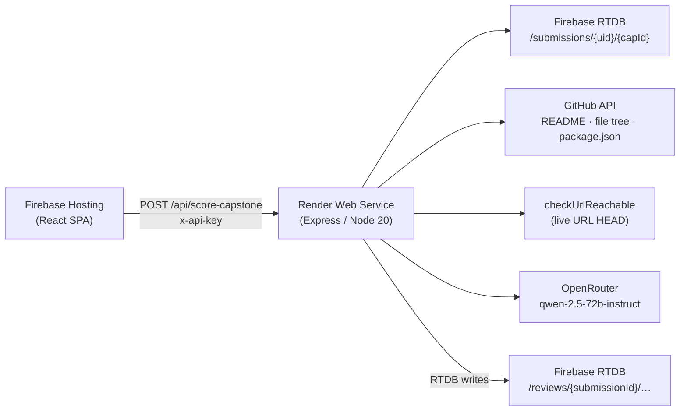

# OrchestrAI AI Review Service

Render-hosted Express/TypeScript microservice that performs Tier A deterministic checks and Tier B AI rubric scoring for OrchestrAI Academy capstone submissions, migrated from Firebase Cloud Functions.

---

## Architecture



---

## Endpoints

| Method | Path | Auth | Description |
|--------|------|------|-------------|
| `GET` | `/api/health` | None | Liveness probe |
| `POST` | `/api/ping` | `x-api-key` | Smoke-test the OpenRouter connection |
| `POST` | `/api/score-capstone` | `x-api-key` | Full Tier A + Tier B rubric scoring |

### POST `/api/score-capstone` — Request Body

```jsonc
{
  "submissionId": "uid_capstoneId",   // required
  "modelOverride": "qwen/...",         // optional — defaults to OPENROUTER_MODEL
  "tierAOnly": false                   // optional — skip AI, return only auto-checks
}
```

### POST `/api/score-capstone` — Response

```jsonc
{
  "success": true,
  "submissionId": "uid_capstoneId",
  "autoChecks": { "githubReachable": true, "hasReadme": true, ... },
  "autoScore": 8,
  "tierBSuggestion": {
    "perCategory": { "authentication": 8, "workflow": 17, ... },
    "rationale": { "authentication": "...", ... },
    "overallObservations": "...",
    "total": 82,
    "model": "qwen/qwen-2.5-72b-instruct",
    "generatedAt": 1700000000000,
    "tokensUsed": { ... }
  }
}
```

---

## Local Development

### Prerequisites
- Node 20+
- An `.env` file (copy from `.env.example`)

### Setup

```bash
cd server
npm install
cp .env.example .env   # then fill in the values
npm run dev            # starts ts-node on port 3001
```

### Test endpoints locally

```bash
# Health check
curl http://localhost:3001/api/health

# Ping OpenRouter
curl -X POST http://localhost:3001/api/ping \
  -H "Content-Type: application/json" \
  -H "x-api-key: YOUR_KEY" \
  -d '{}'

# Score a capstone
curl -X POST http://localhost:3001/api/score-capstone \
  -H "Content-Type: application/json" \
  -H "x-api-key: YOUR_KEY" \
  -d '{"submissionId":"uid_capstoneId","tierAOnly":true}'
```

---

## Render Deployment

1. **Push** the `server/` directory to your GitHub repo (Render will auto-detect `render.yaml`).

2. In the **Render Dashboard** → _New_ → _Web Service_ → connect your repo.

3. Render reads `render.yaml` automatically. Set the following **Environment Variables** in the dashboard (marked `sync: false` — never stored in the YAML):

   | Variable | Where to get it |
   |----------|----------------|
   | `OPENROUTER_API_KEY` | [openrouter.ai/keys](https://openrouter.ai/keys) |
   | `GITHUB_TOKEN` | GitHub → Settings → Developer tokens (optional) |
   | `FIREBASE_DATABASE_URL` | Firebase Console → Project Settings → RTDB |
   | `FIREBASE_PROJECT_ID` | Firebase Console → Project Settings |
   | `FIREBASE_CLIENT_EMAIL` | Firebase Console → Service Accounts → Generate key |
   | `FIREBASE_PRIVATE_KEY` | Same JSON — paste the full `-----BEGIN…` string |
   | `REVIEW_SERVICE_API_KEY` | Any strong random string you choose |

4. Click **Deploy**. Build command: `npm install && npm run build`. Start: `npm start`.

5. Copy the Render service URL (e.g. `https://orchestrai-ai-review.onrender.com`) into your Firebase Hosting app's config.

> [!IMPORTANT]
> `FIREBASE_PRIVATE_KEY` often contains literal `\n` newlines. Render stores it correctly — the service replaces `\\n` → `\n` on startup automatically.

---

## Environment Variable Reference

| Variable | Required | Default | Description |
|----------|----------|---------|-------------|
| `OPENROUTER_API_KEY` | ✅ | — | API key for OpenRouter |
| `OPENROUTER_MODEL` | ✅ | `qwen/qwen-2.5-72b-instruct` | Model slug |
| `OPENROUTER_REFERER` | — | Firebase Hosting URL | `HTTP-Referer` header sent to OpenRouter |
| `OPENROUTER_APP_NAME` | — | `OrchestrAI Academy` | `X-Title` header sent to OpenRouter |
| `GITHUB_TOKEN` | — | — | Raises GitHub API rate limit from 60 → 5000 req/hr |
| `FIREBASE_DATABASE_URL` | ✅ | — | RTDB root URL (`https://…firebaseio.com`) |
| `FIREBASE_PROJECT_ID` | ✅ | — | Firebase project ID |
| `FIREBASE_CLIENT_EMAIL` | ✅ | — | Service-account email |
| `FIREBASE_PRIVATE_KEY` | ✅ | — | Service-account RSA private key |
| `REVIEW_SERVICE_API_KEY` | ⚠️ | — | Shared secret for `x-api-key` header (skip to disable auth) |
| `PORT` | — | `3001` | TCP port the server listens on |
| `ALLOWED_ORIGIN` | — | Firebase Hosting URL | CORS allowed origin |

---

## RTDB Write Paths (unchanged from Cloud Functions)

```
/reviews/{submissionId}/autoChecks       ← Tier A deterministic checks
/reviews/{submissionId}/autoScore        ← Tier A score (0–10)
/reviews/{submissionId}/tierBSuggestion  ← Tier B AI rubric result
```

---

## Rubric (v7 manual — 9 categories, 100 pts total)

| Category | Max pts |
|----------|---------|
| authentication | 10 |
| dashboard | 10 |
| masterData | 10 |
| transactions | 15 |
| workflow | 20 |
| rbac | 15 |
| reports | 10 |
| deployment | 5 |
| documentation | 5 |
